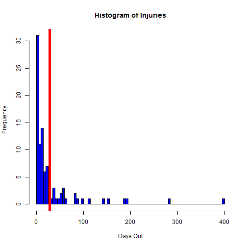

Soccer Injury Predictor
========================================================
author: Daniel Dunn
date: December 14, 2014
transition: rotate

Injuries & Professional Soccer
========================================================

Professional soccer teams are often very susceptible to player injuries.
A team faces not only the loss of the player's services but also the uncertainty of how long the player will be unavailable.

This application helps predict how many days an injured player will be out, given two inputs:
- Did the injury occur during training or a match?
- How many days into the season did the player get injured?

Data was obtained on December 14, 2014 from www.arsenalreport.com/injuryroom

How Model Was Built
========================================================

The dataset was loaded into a local CSV file for analysis. Below are the steps to fit a linear model:


```r
d1 <- read.csv(file="injuries.csv",header=TRUE)
d1$Injury.Date <- as.Date(d1$Injury.Date,format="%m/%d/%Y")
day1 <- as.Date("8/17/2013",format="%m/%d/%Y")
d1 <- d1[d1$Injury.Date>=day1,]
d1$Season.Day <- as.integer(d1$Injury.Date - day1)
d2 <- d1[d1$Injury.Type!="Unknown",c(4:5,7)]
fit1 <- lm(Days.Out~.,data=d2)
```

Example:  injured in training, day 50
========================================================


```r
hist(Season,breaks=60,xlab="Days Out",col="blue",main=("Histogram of Injuries"))
pred1 <- round(43.00103 + -11.72829*1 + -0.05837*50,0);abline(v=pred1,col="red",lwd=5)
```

 

Use Case
========================================================
This application is merely a proof of concept, not a perfected product. Next step would be to improve the predictive model to minimize error. Having this application structure already built should streamline the process of implementing an improved model.

As the error rate improves, the trainer and manager can have a good first estimate of how long a player may be unavailable.
